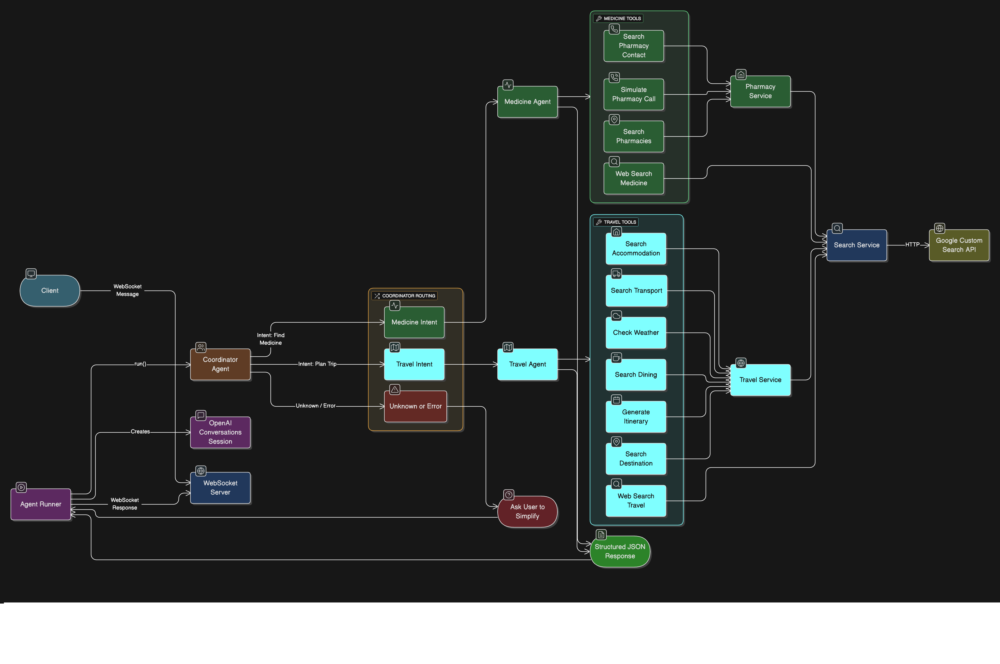

# 🧪 pokus.ai

A multi-agent AI system featuring two specialized assistants: a **Medicine Finder** that locates pharmacies and verifies medicine availability, and a **Travel Planner** that creates comprehensive travel itineraries with real-world data.

## ✨ Features

### 🏥 Medicine Finder
- Search for pharmacies by location and medicine name
- Simulate phone calls to verify stock availability
- Get detailed pharmacy information (addresses, hours, prices)
- Find alternative medicines when primary options are unavailable

### ✈️ Travel Planner
- Research destinations with real-world data
- Find transport options (trains, flights)
- Search accommodations and dining options
- Generate comprehensive itineraries with specific details (train numbers, hotel contacts, prices)

### 🤖 Smart Routing
- Coordinator agent automatically routes requests to the appropriate specialist
- Sequential tool execution for accurate, step-by-step processing
- Real-time WebSocket communication between frontend and server

## 🏗️ Architecture



## 🛠️ Tech Stack

| Layer | Technology |
|-------|------------|
| **Frontend** | Next.js, React, TypeScript, Tailwind CSS, shadcn/ui |
| **Backend** | Bun runtime, TypeScript, WebSocket |
| **AI Framework** | OpenAI Agents SDK, GPT-5.2 |
| **HTTP Client** | Axios |

## 📦 Installation

### Prerequisites
- [Bun](https://bun.sh) (v1.2.15 or later)
- [Node.js](https://nodejs.org) (v18 or later)
- OpenAI API key

### Server Setup

```bash
cd server
bun install
```

### Frontend Setup

```bash
cd frontend
npm install
# or
bun install
```

## ⚙️ Configuration

Create a `.env` file in the `server` directory:

```env
OPENAI_API_KEY=your_openai_api_key_here
GOOGLE_SEARCH_CX=your_google_search_cx_here
GOOGLE_SEARCH_API_KEY=your_google_search_api_key_here
```

## 🚀 Usage

### Start the Server

```bash
cd server
bun run src/index.ts
```

### Start the Frontend

```bash
cd frontend
npm run dev
# or
bun run dev
```

### Example Interactions

**Medicine Finder:**
```
User: Find paracetamol near downtown Seattle
Agent: [Searches pharmacies, simulates calls to verify stock, returns specific pharmacy details]
```

**Travel Planner:**
```
User: Plan a 3-day trip from New York to Boston
Agent: [Researches transport, accommodations, dining, generates complete itinerary]
```


## ⚖️ Assumptions & Trade-offs

### Assumptions
- **Single Instance Deployment**: The architecture uses `AsyncLocalStorage` for session isolation, which is designed for a single server instance. Horizontal scaling would require a distributed state store (e.g., Redis).
- **In-Memory State**: Conversation history and agent state are stored in memory. A server restart clears all active sessions.
- **Trusted Environment**: The application currently has no authentication layer. It assumes usage in a controlled or local environment.
- **Connectivity**: Requires stable internet access for OpenAI and Google Search API calls.

### Trade-offs
- **WebSocket over REST**: Chosen for real-time, bi-directional streaming of logs and partial responses. *Trade-off*: Harder to load balance and cache compared to stateless REST endpoints.
- **Simulated Actions**: "Pharmacy Calls" are simulated for demonstration safety and cost. *Trade-off*: Real-world utility is limited without actual VoIP integration (e.g., Twilio).
- **Client-Side Coupling**: The frontend directly connects to a specific WebSocket port. *Trade-off*: Simplified dev setup but requires configuration changes for production deployment behind reverse proxies.

### Agent-Specific Constraints

#### 🏥 Medicine Finder
- **Real-time Inventory**: Assumes stock availability based on search snippets or simulation. *Trade-off*: Does not connect to live pharmacy ERP systems (e.g., Apollo/MedPlus backend) for guaranteed stock.
- **Geocoding**: Relies on naive location string matching. *Trade-off*: May differ from precise GPS coordinate-based routing.

#### ✈️ Travel Planner
- **Pricing Data**: Extracts pricing from search snippets (Google Search). *Trade-off*: Prices are indicative and not guaranteed bookable rates (no GDS/Amadeus integration).
- **Sequential Reasoning**: Intentionally enforces a step-by-step workflow (Transport → Hotel → Activities). *Trade-off*: Slower execution time compared to parallel fetching, but ensures higher coherence and context retention.

## 🤝 Contributing

1. Fork the repository
2. Create your feature branch (`git checkout -b feature/amazing-feature`)
3. Commit your changes (`git commit -m 'Add amazing feature'`)
4. Push to the branch (`git push origin feature/amazing-feature`)
5. Open a Pull Request

## 📄 License

This project is open source. See the repository for license details.

---

<h2 align="center"> Made with ❤️ using <strong>NOVA</strong><br> by <a href="https://adpandey.com">Aditya</a> </h2>
